# 🔮 RuneCore: Magic Engine for Hytale

[Leia em português](README-PTBR.md) | [API Guide](API_USAGE.md) | [API Reference](docs/API_REFERENCE.md) | [Technical Docs](docs/ELEMENTS.md) | [Manual](RuneCore_Manual.md)

<p align="center">
  
  &nbsp;&nbsp;&nbsp;&nbsp;
  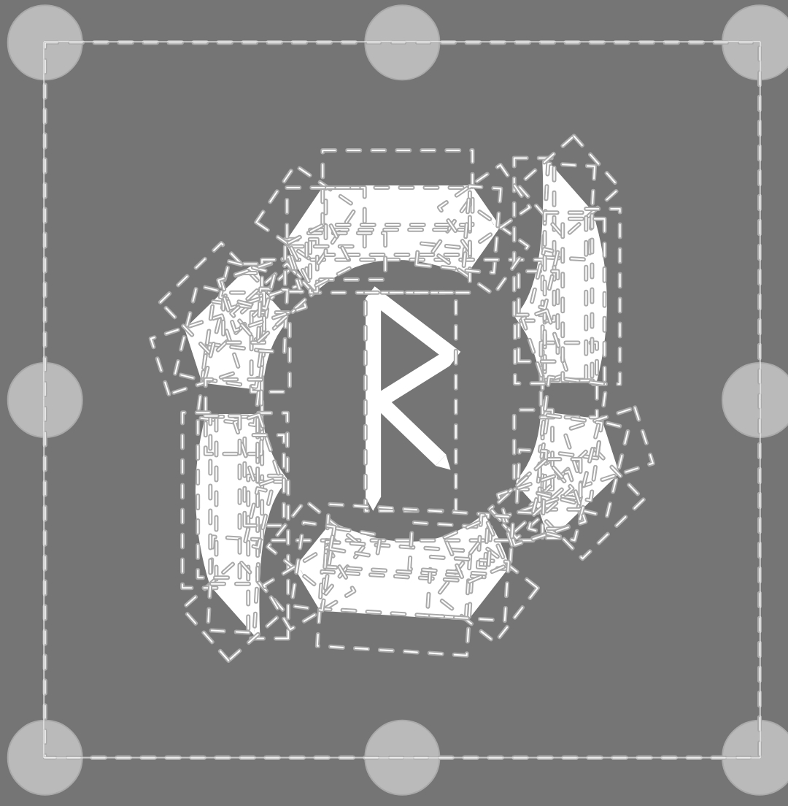
</p>

> [!IMPORTANT]
> **Project Status: Under Development**
>
> - 🛠️ **In Progress:** Drop system and essence drop mechanics are currently being developed.
> - ✅ **Functional:** Core commands and player status management system are fully operational.
> - 🧪 **API:** The API is currently in the testing phase.
> - 🎨 **Visuals:** The project now has its own logo! Essences currently use pixel art icons.
> - 🚀 **Next Steps:** Implementing 3D models for essences by recycling existing in-game assets.
>
> **Note for testing:** If you wish to fully test the mod, please uncomment the system registrations in the main plugin file (`ExamplePlugin.java`).

---

## 1. Vision & Origin 🤔

RuneCore was born from the desire to bring a deep, meaningful magic system to Hytale. While the native system provides a basic foundation, RuneCore expands it into a fully-fledged engine that modders can use to create complex elemental interactions, persistent status effects, and rich magical progression.

Our goal is not just to provide a mod, but an **extensible API** that serves as the backbone for the Hytale magic community.

## 2. What is RuneCore? 📘

RuneCore is a modular magic system engine. It is divided into interdependent modules:

*   **🔹 RuneCore (Core):** Manages essences, mana, and player progress. Provides the API for other modders.
*   **⚔️ RuneMagic:** Focused on spells, runes (passive effects), artifacts, and grimoires.
*   **⚗️ RuneAlchemy:** A chemical and alchemical system for creating potions and enchanting items using essences.

## 3. Elemental Essences 🔮

RuneCore features 20 distinct elements, each with its own essence used for crafting and spellcasting. Below are the high-quality essence icons currently implemented:

### Basic Tier
| Icon | Element | Tier | Icon | Element | Tier |
| :---: | :--- | :--- | :---: | :--- | :--- |
| 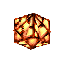 | **Fire** | Basic |  | **Water** | Basic |
| 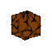 | **Earth** | Basic | 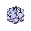 | **Wind** | Basic |
| 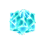 | **Ice** | Basic |  | **Lightning** | Basic |

### Advanced Tier
| Icon | Element | Tier | Icon | Element | Tier |
| :---: | :--- | :--- | :---: | :--- | :--- |
|  | **Life** | Advanced |  | **Death** | Advanced |
| 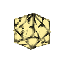 | **Light** | Advanced |  | **Shadow** | Advanced |
|  | **Mind** | Advanced |  | **Blood** | Advanced |

### Unstable & Chemical Tiers
| Icon | Element | Tier | Icon | Element | Tier |
| :---: | :--- | :--- | :---: | :--- | :--- |
|  | **Chaos** | Unstable | 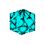 | **Aether** | Unstable |
| 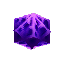 | **Void** | Unstable | 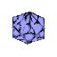 | **Time** | Unstable |
| 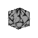 | **Metal** | Chemical |  | **Crystal** | Chemical |
|  | **Poison** | Chemical | 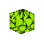 | **Acid** | Chemical |

---

## 4. Mob Drops & Essence Loot Tables 🦅

Every creature in Hytale has a chance to drop elemental essences when defeated by a player. The current base drop rate is **25%**.

| Essence | Dropped by (Common Mobs) |
| :--- | :--- |
| **Fire** | Emberwulf, Fire Dragon, Magma/Flame creatures |
| **Earth** | Trork, Earth Golem, Bison, Tortoise, Molerat |
| **Wind** | Birds (Hawk, Owl, Crow, etc.), Feran Windwalker |
| **Water** | Fish (Shark, Piranha, etc.), Crab, Frog, Whale |
| **Ice** | Polar Bear, Frost Dragon, Yeti, Frost Skeleton |
| **Lightning** | Thunder Golem, Thunder Spirit, Living Spark |
| **Light** | Spirit Root, Christmas Kweebec |
| **Shadow** | Shadow Knight, Wraith, Skrill |
| **Life** | Animals (Cow, Pig, Sheep, Deer), Kweebec |
| **Death** | Skeleton, Zombie, Ghoul |
| **Mind** | Slothian, Outlander Sorcerer |
| **Blood** | Bat, Mosquito |
| **Chaos** | Outlander Berserker, Trork Chieftain |
| **Aether** | Ember Spirit |
| **Void** | Void-corrupted creatures |
| **Metal** | Firesteel Golem, Tank, Turret |
| **Crystal** | Crystal Golem, Scarak |
| **Poison** | Snake, Spider, Scorpion |

---

## 5. Core Features ✨

*   **20 Elements:** Divided into Basic, Advanced, Unstable, and Chemical tiers.
*   **Modular API:** Easily register custom essences, spells, and status effects.
*   **Persistent Status Effects:** A robust system for ticking buffs/debuffs (e.g., Poison, Regeneration, Frozen) with world-aware logic.
*   **Resource Management:** Custom mana, stamina, and biological resource tracking.

For a full breakdown of all 20 elements and their mechanics, see our [**Technical Documentation**](docs/ELEMENTS.md).

---

## 6. 🎮 How to Test In-Game & Current Status Effects

You can test the registered status effects and spell system using the built-in administrative command:

```text
/rune effect <id>
```

Below is the complete table of effects currently registered in the `RuneCore` engine, their development states, and the expected behavior of each:

| Icon | Status | Effect ID | Has Native/JSON Visual? | What it should do |
| :---: | :---: | :--- | :--- | :--- |
| 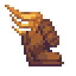 | [x] | `speed` | Speed | Gives movement speed buff. |
| 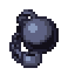 | [x] | `slowness` | Slowness | Slows down the entity. |
| 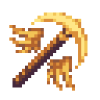 | [ ] | `haste` | Haste | Modifies Attack Speed and Mining Speed (+50%) and shows UI. (Attack/Mining Speed pending) |
| 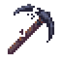 | [ ] | `mining_fatigue`| Mining_Fatigue | Modifies Attack Speed and Mining Speed (-70%) and shows UI. (Attack/Mining Speed pending) |
| 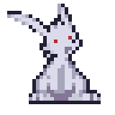 | [x] | `jump_boost` | Jump_Boost | Jump higher. |
| 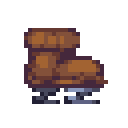 | [x] | `high_jump` | High_Jump | Jump much higher. |
| 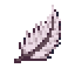 | [x] | `slow_falling` | Slow_Falling | Slow falling. |
|  | [x] | `levitation` | Levitation | Causes the entity to float upwards. |
|  | [x] | `regeneration` | Regeneration | Heals +1 health every 50 ticks. |
|  | [x] | `poison` | Poison | Deals 1 health damage every 25 ticks. |
| 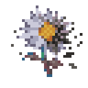 | [x] | `decay` | Decay | Deals 1 health damage every 40 ticks. |
| 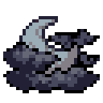 | [x] | `darkness` | Darkness | Reduces vision brightness significantly. |
|  | [x] | `electrified` | Electrified | Deals electric damage and shows sparkles. |
| 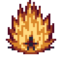 | [x] | `burn` | Burn | Deals 1 health damage every 20 ticks + UI. |
|  | [x] | `nausea` | Nausea | Rotates the camera (NauseaTick) + UI. |
| 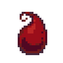 | [x] | `bleeding` | Bleeding | Deals 1 health damage every 20 ticks + UI + Custom blood particles. |
| 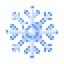 | [x] | `frozen` | Frozen | Prevents movement temporarily. |
| | [x] | `instant_health`| (none) | Instant healing (4.0 * power). |
| | [x] | `instant_damage`| InstantDamage | Instant damage (6.0 * power). |
| | [ ] | `damage_fire_instant`| DamageFireInstant | Instant fire damage (10.0 * power). |
| 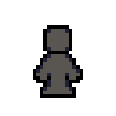 | [x] | `invisibility` | Invisibility | Hides the player from others. (Fine-tuning of own visibility pending) |
| 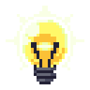 | [ ] | `glowing` | Glowing | Adds dynamic light (DynamicLight) + UI. (Does not persist through logout/relog) |
| 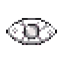 | [x] | `blindness` | Blindness | Modifies vision (VisualEffectHelper) + UI. |
| 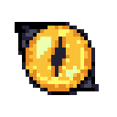 | [x] | `night_vision` | NightVision | White dynamic light around the player + UI. |
|  | [ ] | `water_breathing`| WaterBreathing | Allows native underwater breathing. (Simply does not work) |
| 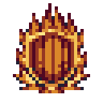 | [x] | `fire_resistance`| FireResistance | Native fire resistance. |
| 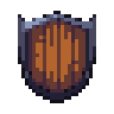 | [ ] | `resistance` | Resistance | Native resistance. (Does not work, needs improvements) |
| 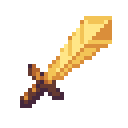 | [ ] | `strength` | Strength | Native strength. (Does not work, needs improvements) |
| 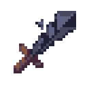 | [ ] | `weakness` | Weakness | Native weakness. (Does not work, needs improvements) |

### Implementation Note
To enable all systems during development, ensure they are registered in your entry point:
```java
// In your plugin class
eventRegistry.registerGlobal(EffectTimerListener.class);
eventRegistry.registerGlobal(CastListener.class);
```

### 🧠 How and Where to Use Effects (Examples)

Modders can apply these effects dynamically in the world using the `RuneCore` API. Here are some examples of programmatic implementation:

```java
// Apply an effect directly to an entity (e.g., player or mob)
RuneCore core = RuneCore.getInstance();
RuneEffect poison = core.getEffect("poison");

if (poison != null) {
    // Create context with source and target
    CastContext ctx = new CastContext(sourceEntity, targetEntity);
    poison.execute(ctx);
}
```

#### 🛡️ Recommended Use Cases:

*   **🧪 Alchemy and Potions:** Consume items that give buffs like `speed`, `jump_boost`, or heals like `regeneration` and `instant_health`.
*   **⚔️ Weapon and Arrow Enchantments:** Add poison (`poison`), bleeding (`bleeding`), or slowness (`slowness`) when hitting targets with specific weapons.
*   **👹 Boss / Mob Mechanics:**
    *   An ice boss that freezes (`frozen`) the player in a charged attack.
    *   A dark attack that inflicts blindness (`blindness`) in the area around the boss.
    *   A fire monster that burns (`burn`) on contact.
*   **🌍 Environmental Traps:**
    *   Spikes on the ground that cause `bleeding`.
    *   Falling into toxic swamps that apply `decay`.

---

## 7. 🛠️ Modder's Guide

Interested in building on top of RuneCore? Check out our [**API Usage Guide**](API_USAGE.md) for code examples and integration steps.

## 8. ⚖️ License

This project, including its source code, documentation, and **pixel art icons** (located in the `/icons` directory), is licensed under the **Creative Commons Attribution-NonCommercial 4.0 International (CC BY-NC 4.0)**.

- **Attribution (BY):** You must give appropriate credit to the original author.
- **NonCommercial (NC):** You may not use the material for commercial purposes.
- **Derivative works:** You may remix and build upon this work under a different license, as long as you respect the conditions above.

For more details, see the [LICENSE](LICENSE) file or visit [Creative Commons](https://creativecommons.org/licenses/by-nc/4.0/).
