# 🔮 RuneCore: Magic Engine for Hytale

[Leia em português](README-PTBR.md) | [API Guide](API_USAGE.md) | [API Reference](docs/API_REFERENCE.md) | [Technical Docs](docs/ELEMENTS.md) | [Manual](RuneCore_Manual.md)

<p align="center">
  
  &nbsp;&nbsp;&nbsp;&nbsp;
  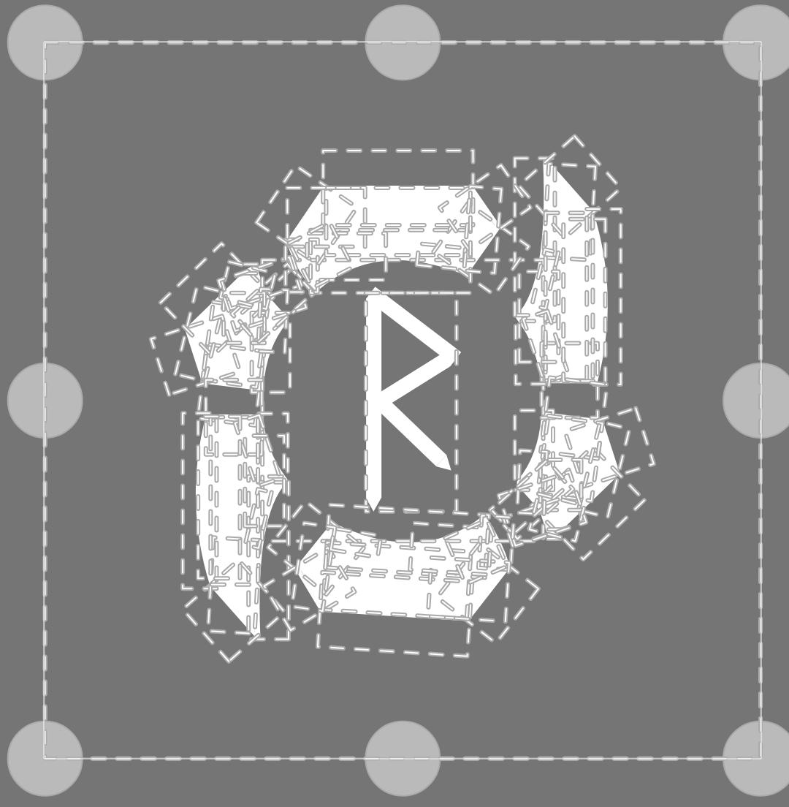
</p>

> [!IMPORTANT]
> **Project Status: Under Development**
>
> - 🛠️ **In Progress:** Developing new potions and crafting recipes to utilize the new status effects.
> - ✅ **Functional:** Core commands, player status management, and essence drop system.
> - 🧪 **API:** The API is currently in the testing phase.
> - 🎨 **Visuals:** Custom logo and high-quality essence icons. 3D models for essences are now implemented using recycled game assets.
> - 🚀 **Next Steps:** Implementing the full **RuneAlchemy** system and complex potion brewing.

---

## 1. Vision & Origin 🤔

RuneCore was born from the desire to bring a deep, meaningful magic system to Hytale. While the native system provides a basic foundation, RuneCore expands it into a fully-fledged engine that modders can use to create complex elemental interactions, persistent status effects, and rich magical progression.

Our goal is not just to provide a mod, but an **extensible API** that serves as the backbone for the Hytale magic community.

## 2. What is RuneCore? 📘

RuneCore is a modular magic system engine. It is divided into interdependent modules:

*   **🔹 RuneCore (Core):** Manages essences, mana, and player progress. Provides the API for other modders.
*   **⚔️ RuneMagic:** Focused on spells, runes (passive effects), artifacts, and grimoires.
*   **⚗️ RuneAlchemy:** A chemical and alchemical system for creating potions and enchanting items using essences.

## 3. Elemental Essences 🔮

RuneCore features 20 distinct elements, each with its own essence used for crafting and spellcasting. Below are the high-quality essence icons currently implemented:

### Basic Tier
| Icon | Element | Tier | Icon | Element | Tier |
| :---: | :--- | :--- | :---: | :--- | :--- |
|  | **Fire** | Basic |  | **Water** | Basic |
|  | **Earth** | Basic |  | **Wind** | Basic |
|  | **Ice** | Basic |  | **Lightning** | Basic |

### Advanced Tier
| Icon | Element | Tier | Icon | Element | Tier |
| :---: | :--- | :--- | :---: | :--- | :--- |
|  | **Life** | Advanced |  | **Death** | Advanced |
|  | **Light** | Advanced |  | **Shadow** | Advanced |
|  | **Mind** | Advanced |  | **Blood** | Advanced |

### Unstable & Chemical Tiers
| Icon | Element | Tier | Icon | Element | Tier |
| :---: | :--- | :--- | :---: | :--- | :--- |
|  | **Chaos** | Unstable |  | **Aether** | Unstable |
|  | **Void** | Unstable |  | **Time** | Unstable |
|  | **Metal** | Chemical |  | **Crystal** | Chemical |
|  | **Poison** | Chemical |  | **Acid** | Chemical |

---

## 4. Mob Drops & Essence Loot Tables 🦅

Every creature in Hytale has a chance to drop elemental essences when defeated by a player. The current base drop rate is **25%**.

| Essence | Dropped by (Common Mobs) |
| :--- | :--- |
| **Fire** | Emberwulf, Fire Dragon, Magma/Flame creatures |
| **Earth** | Trork, Earth Golem, Bison, Tortoise, Molerat |
| **Wind** | Birds (Hawk, Owl, Crow, etc.), Feran Windwalker |
| **Water** | Fish (Shark, Piranha, etc.), Crab, Frog, Whale |
| **Ice** | Polar Bear, Frost Dragon, Yeti, Frost Skeleton |
| **Lightning** | Thunder Golem, Thunder Spirit, Living Spark |
| **Light** | Spirit Root, Christmas Kweebec |
| **Shadow** | Shadow Knight, Wraith, Skrill |
| **Life** | Animals (Cow, Pig, Sheep, Deer), Kweebec |
| **Death** | Skeleton, Zombie, Ghoul |
| **Mind** | Slothian, Outlander Sorcerer |
| **Blood** | Bat, Mosquito |
| **Chaos** | Outlander Berserker, Trork Chieftain |
| **Aether** | Ember Spirit |
| **Void** | Void-corrupted creatures |
| **Metal** | Firesteel Golem, Tank, Turret |
| **Crystal** | Crystal Golem, Scarak |
| **Poison** | Snake, Spider, Scorpion |

---

## 5. Core Features ✨

*   **20 Elements:** Divided into Basic, Advanced, Unstable, and Chemical tiers.
*   **Modular API:** Easily register custom essences, spells, and status effects.
*   **Persistent Status Effects:** A robust system for ticking buffs/debuffs (e.g., Poison, Regeneration, Frozen) with world-aware logic.
*   **Resource Management:** Custom mana, stamina, and biological resource tracking.

For a full breakdown of all 20 elements and their mechanics, see our [**Technical Documentation**](docs/ELEMENTS.md).

---

## 6. ⚗️ Potion Crafting Recipes

All potions are crafted at the **Alchemy Bench** using a **Glass Bottle** (Potion_Empty) + an **Elemental Essence** + a **Secondary Material**. Crafting time: **4 seconds**.

| Potion | Essence | Qty | Secondary Material | Qty |
| :--- | :--- | :---: | :--- | :---: |
| **Speed** | Wind Essence | 1 | Feathers (Light) | 2 |
| **Slowness** | Earth Essence | 1 | Bramble Moss | 2 |
| **Haste** | Lightning Essence | 1 | Crystal (Yellow) | 1 |
| **Mining Fatigue** | Earth Essence | 1 | Bone Fragment | 2 |
| **Jump Boost** | Wind Essence | 1 | Feathers (Blue) | 2 |
| **High Jump** | Aether Essence | 1 | Feathers (Red) | 2 |
| **Slow Falling** | Wind Essence | 1 | Feathers (Dark) | 3 |
| **Levitation** | Aether Essence | 2 | Crystal (White) | 2 |
| **Regeneration** | Life Essence | 2 | Pink Flower | 3 |
| **Poison** | Poison Essence | 1 | Poison Mushroom | 2 |
| **Decay** | Death Essence | 1 | Bone Fragment | 3 |
| **Burn** | Fire Essence | 1 | Charcoal | 2 |
| **Nausea** | Chaos Essence | 1 | Green Mushroom | 2 |
| **Bleeding** | Blood Essence | 1 | Crystal (Red) | 1 |
| **Frozen** | Ice Essence | 1 | Crystal (Cyan) | 2 |
| **Instant Health** | Life Essence (Concentrated) | 1 | Red Flower | 3 |
| **Instant Damage** | Void Essence | 1 | Boom Powder | 2 |
| **Invisibility** | Shadow Essence | 2 | Crystal (White) | 2 |
| **Glowing** | Light Essence | 1 | Glowing Mushroom (Orange) | 2 |
| **Blindness** | Shadow Essence | 1 | Crystal (Purple) | 2 |
| **Night Vision** | Light Essence | 1 | Glowing Mushroom (Blue) | 2 |
| **Water Breathing** | Water Essence | 1 | Blue Coral | 3 |
| **Fire Resistance** | Fire Essence | 2 | Crystal (Red) | 2 |
| **Resistance** | Metal Essence | 2 | Crystal (Blue) | 2 |
| **Strength** | Blood Essence | 2 | Crystal (Red) | 2 |
| **Weakness** | Death Essence | 1 | Grey Flower | 2 |

> **Note:** More powerful effects (Levitation, Invisibility, Resistance, Strength, Fire Resistance, Regeneration) require **2 essences** instead of 1.

---

## 7. ⚔️ Combat Stats System

RuneCore includes an RPG-style combat stats system layered on top of Hytale's native armor/damage.

Attributes are **registrable**: the stats below are the ones RuneCore ships with, but any mod can add its own and have it affect damage. See the [API Usage Guide](API_USAGE.md#6-combat-attributes).

Players carry a persistent stat block. Creatures do not — their values come from a static registry lookup, so nothing is tracked per entity.

### Stat Types

| Category | Stat | Description |
|----------|------|-------------|
| **Offensive** | Physical Damage | Reduced by target's Armor |
| **Offensive** | Magic Damage | Reduced by target's Magic Resist |
| **Offensive** | True Damage | Bypasses all resistances and reductions (only blocked by shields) |
| **Offensive** | Armor Penetration | Ignores part of target's Armor |
| **Offensive** | Magic Penetration | Ignores part of target's Magic Resist |
| **Defensive** | Armor | Reduces incoming Physical Damage |
| **Defensive** | Magic Resist | Reduces incoming Magic Damage |
| **Defensive** | Damage Reduction | Flat % reduction on all damage (capped at 90%) |
| **Defensive** | Shield HP | Temporary HP that absorbs damage before health |

### Damage Formula

```
effectiveDefense = max(0, defense - penetration)
reducedDamage = rawDamage × 100 / (100 + effectiveDefense)
finalDamage = (physReduced + magReduced) × (1 - damageReduction%) + trueDamage
→ Shield absorbs first, remainder hits HP
```

Every intercepted hit runs through the **damage pipeline**, so mods can insert their own step
before or after this calculation — that is how a custom attribute such as crit or lifesteal
gets to influence the result. See [Damage Pipeline](API_USAGE.md#7-damage-pipeline).

**Offence sources.** A player's offensive stats come from two places: the persistent stat block
(equipment) and the **weapon currently held**, resolved at the moment of the hit so hotbar swaps
apply immediately.

### Creature Damage (PvE)

Creatures have pre-registered **damage profiles** in `CreatureCombatRegistry`. When a creature hits a player, RuneCore looks up the creature's profile and applies the correct defense formula with the creature's armor/magic penetration. If a creature is not registered, it falls back to `DamageCause` classification.

Creatures are also **damage targets**: they carry armor, magic resist and damage reduction, so weapon stats and penetration matter in PvE as well. A creature absent from the registry is left untouched — its damage stays exactly as the engine computed it.

| Damage Profile | Formula | Example Creatures |
|---------------|---------|-------------------|
| **Physical** | Armor reduces, creature may have armor pen | Trork, Skeleton Fighter, Wolf, Bear |
| **Magic** | Magic Resist reduces, creature may have magic pen | Skeleton Mage, Wraith, Necromancer, Spirits |
| **Hybrid** | Split phys/magic by ratio, each reduced separately | Dragon Fire (60% magic), Golem Crystal Flame, Feran Windwalker |
| **True** | No reduction (only shield absorbs) | — |

After type-specific reduction, **Damage Reduction %** is applied, then **Shield HP** absorbs what remains. If no creature data is found, `DamageCause` is used as fallback:

| Damage Cause | Reduced by |
|-------------|------------|
| Physical, Projectile, Bludgeoning, Slashing | **Armor** |
| Elemental, Fire, Ice, Poison, Magic | **Magic Resist** |
| True (or BypassResistances) | **Shield only** |

#### Registered Creatures (~200+)

| Faction | Creatures | Typical Profile |
|---------|-----------|----------------|
| Trork | Warrior, Brawler, Guard, Hunter, Mauler, Chieftain, Shaman, Doctor Witch | Physical (warriors), Magic (shaman/witch) |
| Skeleton | Standard, Burnt, Frost, Sand, Incandescent, Pirate (~35 variants) | Physical (melee), Hybrid (elemental), Magic (mages) |
| Zombie | Regular, Aberrant, Burnt, Frost, Sand, Werewolf | Physical, Hybrid (elemental variants) |
| Goblin | Scrapper, Thief, Miner, Lobber, Boss, Duke, Ogre | Physical, Hybrid (lobber/duke) |
| Outlander | Peon, Marauder, Berserker, Brute, Hunter, Cultist, Priest, Sorcerer | Physical (warriors), Magic (casters) |
| Scarak | Louse, Seeker, Fighter, Defender, Broodmother | Physical, Hybrid (broodmother) |
| Feran | Burrower, Longtooth, Sharptooth, Windwalker | Physical, Hybrid (windwalker) |
| Dragons | Fire, Frost, Void | Hybrid (60-70% magic, high pen) |
| Golems | Crystal Earth/Flame/Frost/Sand/Thunder, Firesteel, Guardian Void | Physical (earth/sand), Hybrid (elemental) |
| Void | Crawler, Eye, Larva, Necromancer, Spawn, Spectre, Wraith | Magic (high pen) |
| Bosses | Shadow Knight, Yeti, Werewolf, Emberwulf | Hybrid/Physical (high pen) |
| Wildlife | Bears, Wolves, Spiders, Snakes, Sharks, Cave creatures | Physical (most), Hybrid (snakes, magma variants) |
| Spirits | Ember, Frost, Root, Thunder, Spark | Magic |

#### Creature Defence by Family

Defence is assigned per family. These are a first pass and want in-game balancing; any creature
can override its family with `withDefense(...)`.

| Family | Armor | Magic Resist | DR | Rationale |
| :--- | ---: | ---: | ---: | :--- |
| Wildlife | 2 | 0 | — | critters and cattle, effectively unarmoured |
| Zombies | 4 | 2 | — | rotten and slow |
| Spirits | 4 | 32 | — | incorporeal: blades pass through, magic bites |
| Goblins | 5 | 3 | — | scrappy leather |
| Trorks | 6 | 0 | — | tribal warriors, no wards |
| Ferans | 8 | 8 | — | agile beasts, balanced |
| Misc | 8 | 8 | — | unclassified |
| Skeletons | 10 | 4 | — | bone turns blades better than magic |
| Outlanders | 12 | 6 | — | equipped raiders |
| Void | 12 | 28 | — | inverted: magic is their shield |
| Scaraks | 18 | 4 | — | chitin: heavy against steel, poor against magic |
| Dragons | 32 | 28 | — | scaled and ancient |
| Golems | 34 | 12 | — | the physical wall |
| Bosses | 40 | 34 | 15% | plus flat damage reduction |

> **Note:** creatures are still not *tracked* — the registry is a static lookup keyed by model
> asset name, with no per-entity state.

### Equipment Integration

Items registered in `CombatStatsRegistry` apply their combat stats in two ways: **armor pieces** contribute while equipped (recalculated on every armor change), and the **held weapon** contributes at the moment of the hit. All vanilla Hytale armors and weapons are pre-registered, and mods can register their own through `RuneAttributes.registerItem(...)`.

#### Armor Stats by Tier

Armor pieces scale by slot: Chest 100%, Legs 85%, Head 70%, Hands 50%.

| Tier | Materials | Armor (Chest) | Magic Resist (Chest) |
|------|-----------|:-------------:|:--------------------:|
| 1 | Cloth (Cotton, Linen, Wool, Silk, Cindercloth), Wood | 4–8 | 10–20 |
| 2 | Leather Soft/Light, Copper | 10–14 | 8–10 |
| 3 | Leather Medium/Heavy/Raven, Bronze, Iron | 18–25 | 5–8 |
| 4 | Steel, Steel Ancient, Cobalt | 30–35 | 5–7 |
| 5 | Mithril, Thorium | 42–45 | 12–14 |
| 6 | Adamantite, Onyxium, Prisma | 50–58 | 18–22 |

> **Design:** Cloth/magic armor has low Armor but high Magic Resist. Metal armor has high Armor but low Magic Resist. Higher tiers (Mithril+) balance both.

#### Weapon Stats by Type

| Type | Primary Stat | Secondary Stat | Identity |
|------|-------------|----------------|----------|
| Swords | Physical Damage | — | Balanced melee |
| Longswords | Physical Damage (high) | — | Slow, heavy hits |
| Axes | Physical Damage | Armor Penetration | Anti-armor melee |
| Battleaxes | Physical Damage (high) | Armor Penetration (high) | Heavy anti-armor |
| Clubs / Maces | Physical Damage | — | Blunt melee |
| Spears | Physical Damage | Magic Penetration | Anti-mage melee |
| Daggers | Physical Damage (low) | Armor Penetration (very high) | Assassin / shred |
| Staffs | Magic Damage | — | Mage basic weapon |
| Spellbooks | Magic Damage (high) | Magic Penetration | Mage burst |
| Wands | Magic Damage (light) | — | Mage utility |
| Bows / Crossbows | Physical Damage | — | Ranged physical |
| Shields | Armor | Shield HP | Defensive |
| Guns / Bombs | Physical Damage | Armor Penetration | Ranged explosive |

> **Hybrid weapons:** Some special variants (Frost Sword, Void Longsword, Flame Bow, etc.) deal both Physical and Magic damage.

#### Weapon Damage by Tier (Physical weapons example)

| Material | Sword | Longsword | Axe | Battleaxe | Dagger |
|----------|:-----:|:---------:|:---:|:---------:|:------:|
| Crude/Wood | 6–8 | 12 | 10 | 14 | 6 |
| Copper | 14 | 20 | 16 | 22 | 10 |
| Bronze | 18 | — | — | — | 14 |
| Iron | 22 | 30 | 24 | 32 | 18 |
| Steel | 28 | — | — | 34 | — |
| Cobalt | 30 | 40 | 32 | 42 | 24 |
| Mithril | 38 | 50 | 40 | 52 | 30 |
| Thorium | 42 | 55 | 44 | 56 | 34 |
| Onyxium | 48 | 62 | 50 | 64 | 38 |
| Adamantite | 50 | 65 | 52 | 68 | 40 |

### Commands

| Command | Description |
|---------|-------------|
| `/combatstats view` | View all your current combat stats |
| `/combatstats set <stat> <value>` | Set a stat's base value |
| `/combatstats add <stat> <value>` | Add a modifier (stacks on top of base) |
| `/combatstats reset all` | Reset all stats to 0 |
| `/combatstats reset <stat>` | Reset a specific stat to 0 |
| `/combatstats reset modifiers` | Clear only modifiers, keep base values |

**Available stats:** `armor`, `magicresist` (mr), `reduction` (dr), `physdmg` (phys), `magdmg` (mag), `truedmg` (true), `armorpen` (apen), `magicpen` (mpen), `shield`

**Examples:**
```
/combatstats set armor 50
/combatstats set physdmg 80
/combatstats add mr 20
/combatstats set shield 100
/combatstats set reduction 30     (30% damage reduction)
/combatstats view
/combatstats reset all
```

---

## 8. 🎮 How to Test In-Game & Current Status Effects

You can test the registered status effects and spell system using the built-in administrative command:

```text
/rune effect <id>
```

Below is the complete table of effects currently registered in the `RuneCore` engine, their development states, and the expected behavior of each:

| Icon | Status | Effect ID | Has Native/JSON Visual? | What it should do |
| :---: | :---: | :--- | :--- | :--- |
| 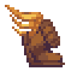 | [x] | `speed` | Speed | Gives movement speed buff. |
| 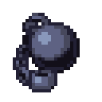 | [x] | `slowness` | Slowness | Slows down the entity. |
|  | [ ] | `haste` | Haste | Modifies Attack Speed and Mining Speed (+50%) and shows UI. (Attack/Mining Speed pending) |
| 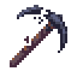 | [ ] | `mining_fatigue`| Mining_Fatigue | Modifies Attack Speed and Mining Speed (-70%) and shows UI. (Attack/Mining Speed pending) |
|  | [x] | `jump_boost` | Jump_Boost | Jump higher. |
| 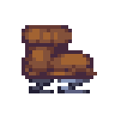 | [x] | `high_jump` | High_Jump | Jump much higher. |
|  | [x] | `slow_falling` | Slow_Falling | Slow falling. |
|  | [x] | `levitation` | Levitation | Causes the entity to float upwards. |
|  | [x] | `regeneration` | Regeneration | Heals +1 health every 50 ticks. |
|  | [x] | `poison` | Poison | Deals 1 health damage every 25 ticks. |
| 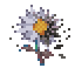 | [x] | `decay` | Decay | Deals 1 health damage every 40 ticks. |
| 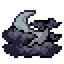 | [x] | `darkness` | Darkness | Reduces vision brightness significantly. |
|  | [x] | `electrified` | Electrified | Deals electric damage and shows sparkles. |
| 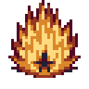 | [x] | `burn` | Burn | Deals 1 health damage every 20 ticks + UI. |
|  | [x] | `nausea` | Nausea | Rotates the camera (NauseaTick) + UI. |
|  | [x] | `bleeding` | Bleeding | Deals 1 health damage every 20 ticks + UI + Custom blood particles. |
|  | [x] | `frozen` | Frozen | Prevents movement temporarily. |
| | [x] | `instant_health`| (none) | Instant healing (4.0 * power). |
| | [x] | `instant_damage`| InstantDamage | Instant damage (6.0 * power). |
| | [ ] | `damage_fire_instant`| DamageFireInstant | Instant fire damage (10.0 * power). |
|  | [x] | `invisibility` | Invisibility | Hides the player from others. (Fine-tuning of own visibility pending) |
|  | [ ] | `glowing` | Glowing | Adds dynamic light (DynamicLight) + UI. (Does not persist through logout/relog) |
|  | [x] | `blindness` | Blindness | Modifies vision (VisualEffectHelper) + UI. |
|  | [x] | `night_vision` | NightVision | White dynamic light around the player + UI. |
|  | [ ] | `water_breathing`| WaterBreathing | Allows native underwater breathing. (Simply does not work) |
|  | [x] | `fire_resistance`| FireResistance | Native fire resistance. |
| 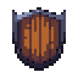 | [ ] | `resistance` | Resistance | Native resistance. (Does not work, needs improvements) |
| 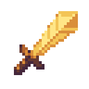 | [ ] | `strength` | Strength | Native strength. (Does not work, needs improvements) |
| 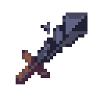 | [ ] | `weakness` | Weakness | Native weakness. (Does not work, needs improvements) |

### Implementation Note
To enable all systems during development, ensure they are registered in your entry point:
```java
// In your plugin class
eventRegistry.registerGlobal(EffectTimerListener.class);
eventRegistry.registerGlobal(CastListener.class);
```

### 🧠 How and Where to Use Effects (Examples)

Modders can apply these effects dynamically in the world using the `RuneCore` API. Here are some examples of programmatic implementation:

```java
// Apply an effect directly to an entity (e.g., player or mob)
RuneCore core = RuneCore.getInstance();
RuneEffect poison = core.getEffect("poison");

if (poison != null) {
    // Create context with source and target
    CastContext ctx = new CastContext(sourceEntity, targetEntity);
    poison.execute(ctx);
}
```

#### 🛡️ Recommended Use Cases:

*   **🧪 Alchemy and Potions:** Consume items that give buffs like `speed`, `jump_boost`, or heals like `regeneration` and `instant_health`.
*   **⚔️ Weapon and Arrow Enchantments:** Add poison (`poison`), bleeding (`bleeding`), or slowness (`slowness`) when hitting targets with specific weapons.
*   **👹 Boss / Mob Mechanics:**
    *   An ice boss that freezes (`frozen`) the player in a charged attack.
    *   A dark attack that inflicts blindness (`blindness`) in the area around the boss.
    *   A fire monster that burns (`burn`) on contact.
*   **🌍 Environmental Traps:**
    *   Spikes on the ground that cause `bleeding`.
    *   Falling into toxic swamps that apply `decay`.

---

## 9. Build & Development 🛠️

To compile, validate, and develop with RuneCore, you need to configure your local paths.

### 1. Create a `local.properties` file at the root of the project:
```properties
# Path to the official Hytale client Assets zip
hytale.assets.path=/path/to/Hytale/Assets.zip

# Target folder where the built mod JAR will be outputted
hytale.mods.dest=/path/to/Hytale/Mods/
```

### 2. Create a `gradle.properties` file (if not present) at the root of the project:
```properties
# Path to your local Hytale JDK 21 installation (forces the Gradle daemon to run on a compatible version)
org.gradle.java.home=/path/to/Hytale/jdk-25
```

### Useful Gradle Tasks:
*   **Compile Mod:** `./gradlew jar` (compiles the mod using JDK 25 toolchain and copies the JAR to the target mods folder).
*   **Check Hytale Version:** `./gradlew hytaleVersion` (displays the current HytaleServer engine version).
*   **Generate JSON Schemas:** `./gradlew generateSchemas` (extracts assets schema to the local `Schema/` folder).
*   **Validate Mod Configs:** `./gradlew validateAssets` (tests local mod JSON configurations using Hytale's compiler).

---

## 10. Modder's Guide

Interested in building on top of RuneCore? Check out our [**API Usage Guide**](API_USAGE.md) for code examples and integration steps.

The public entry points are:

| Entry point | Purpose |
| :--- | :--- |
| `RuneAttributes` | Read/write attributes, register items and creatures |
| `AttributeRegistry` + `RuneAttribute` | Declare a new attribute |
| `DamagePipeline` + `DamageStage` | Make an attribute affect damage |
| `RuneCore` | Essences, effects, spells |
| `RuneCoreItemManager` | Create interactive/clickable items |
| `EffectHelper`, `StatHelper`, `PlayerStats` | Entity stat and movement helpers |

---

## 11. ⚖️ License

This project, including its source code, documentation, and **pixel art icons** (located in the `/icons` directory), is licensed under the **Creative Commons Attribution-NonCommercial 4.0 International (CC BY-NC 4.0)**.

- **Attribution (BY):** You must give appropriate credit to the original author.
- **NonCommercial (NC):** You may not use the material for commercial purposes.
- **Derivative works:** You may remix and build upon this work under a different license, as long as you respect the conditions above.

For more details, see the [LICENSE](LICENSE) file or visit [Creative Commons](https://creativecommons.org/licenses/by-nc/4.0/).
